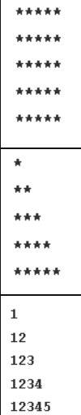

# Patterns 

> Patterns are great way to increase the understanding of working with loops and build some logical thinking 

_This are problems which are refered to Strivers A2Z DSA Course/Sheet_

# Pass by refernce 

([GFG link to pass by refernce](https://www.geeksforgeeks.org/different-ways-to-achieve-pass-by-reference-in-java/))
